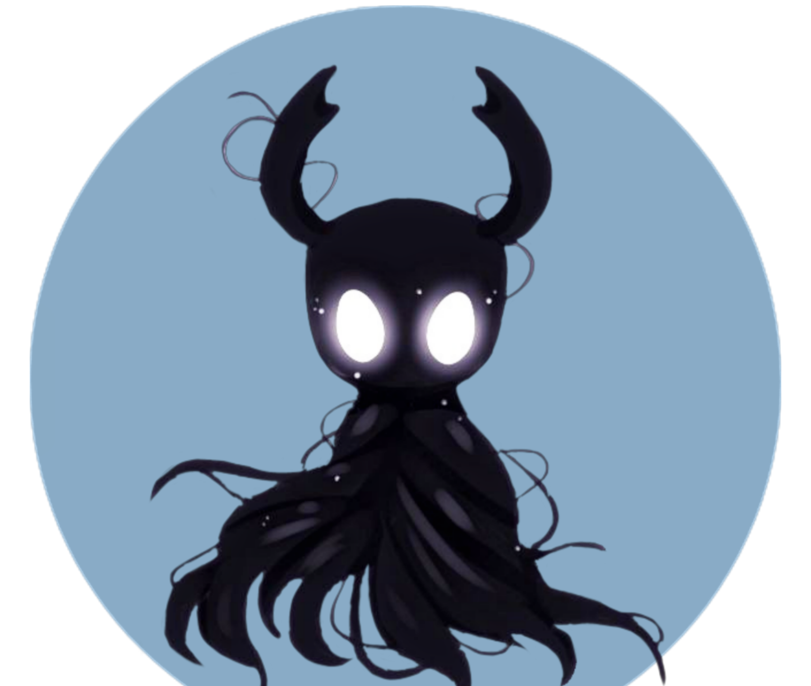

## TermuxVoid-Theme 🚀



A professional terminal customization for Termux that transforms your mobile Linux experience with:

- 🐟 Fish shell with intelligent tab completion
- 🚀 Starship cross-shell prompt
- 🎨 Custom color schemes and fonts
- 🖼️ Optional ASCII art banner support
- 🔄 Automatic dependency handling

## ✨ Features

- **One-click installation**
- **Custom prompt with your name**
- **Banner customization** (use your own image!)
- **Automatic shell configuration**
- **Clean uninstall** (no leftovers)

## 🛠️ Installation

### Quick Install (Recommended)
```bash
curl -LO https://github.com/termuxvoid/TermuxVoid-Theme/raw/main/termuxvoid-theme.sh && bash termuxvoid-theme.sh
```

### Alternative Install
```bash
apt update && apt install termuxvoid-theme
```

## 🖼️ Banner Customization
During installation you can:
1. Use the default `tvr.png` banner
2. Provide your own image path
3. Skip banner completely

## 🎨 Components Installed
| Component          | Location                  |
|--------------------|---------------------------|
| Fish config        | `~/.config/fish/`         |
| Starship config    | `~/.config/`              |
| Color scheme       | `~/.termux/colors.properties` |
| Custom font       | `~/.termux/font.ttf`      |

## 🔄 Post-Installation
After installation **restart Termux** to see all changes.

## 📝 Requirements
- Termux (latest version recommended)
- Internet connection for installation

## 🌟 Credits
Developed by [Alienkrishn](https://github.com/Anon4You)

